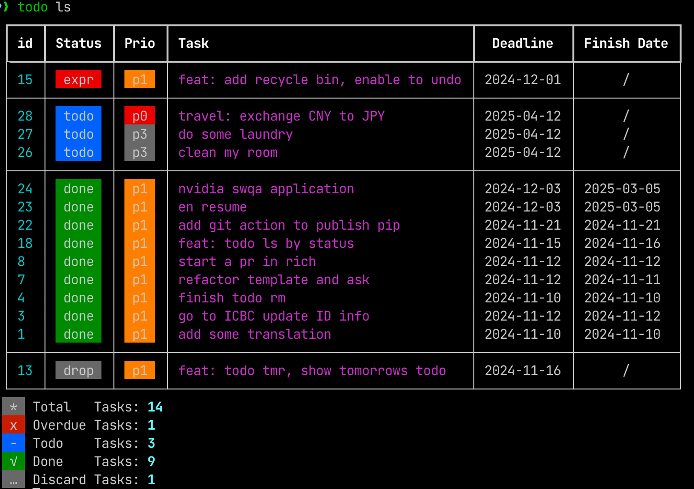

```
                                                   __
 __________  ____  ____        _________ ___  ____/ /
/_  __/ __ \/ __ \/ __ \______/ ___/ __ `__ \/ __  / 
 / / / /_/ / /_/ / /_/ /_____/ /__/ / / / / / /_/ /  
/_/  \____/_____/\____/      \___/_/ /_/ /_/\__,_/   
                         
```

欢迎使用 **todo-cmd**，这是一个简单的工具，帮助您在命令行中轻松管理代办、记录完成事项。




## 1. 特性

1. 命令行优先，使用简单，快速上手。
2. 美观的 TUI 展示
3. 支持多种状态：`进行`、`完成`、`逾期`、`丢弃`
4. 支持任务优先级：p0, p1, p2, p3

## 2. 安装

有多种安装方法，推荐使用 `uv` 或 `pipx`

### 2.1 👍 uv 或 pipx 安装

```bash
# 若您未曾安装 uv，请先执行
pip3 install uv

# 使用 uv 安装
uv tool install todo-cmd

# 或使用 pipx
pipx install todo-cmd
```

卸载

```bash
# 使用 uv
uv tool uninstall todo-cmd

# 使用 pipx
pipx uninstall todo-cmd
```

### 2.2 pip 安装

```shell
pip3 install todo_cmd
```

## 3. 使用方法

### 新建一个 todo

```bash
todo add ${task}

# 也可使用 a 简写
todo a ${task}

# 新建同时设置截止日期
todo add ${task} --deadline ${YYYYMMdd}
todo add ${task} -ddl ${YYYYMMdd}
```

### 直接记录一个完成的事

```shell
todo log ${task}

# 或使用 l 简写
todo l ${task}
```

### 列出所有任务

```shell
todo ls
```
```txt
┏━━━━┳━━━━━━━━┳━━━━━━━━━━━━━━━━━━━━━━━━━━━━━━━━━━━━━━┳━━━━━━━━━━━━┳━━━━━━━━━━━━━┓
┃ id ┃ Status ┃ Task                                 ┃  Deadline  ┃ Finish Date ┃
┡━━━━╇━━━━━━━━╇━━━━━━━━━━━━━━━━━━━━━━━━━━━━━━━━━━━━━━╇━━━━━━━━━━━━╇━━━━━━━━━━━━━┩
│ 10 │  expr  │ Apply a card for my electric-bike    │ 2024-11-10 │      /      │
├────┼────────┼──────────────────────────────────────┼────────────┼─────────────┤
│ 9  │  todo  │ ask Liuke about perf monitor scripts │ 2024-11-13 │      /      │
├────┼────────┼──────────────────────────────────────┼────────────┼─────────────┤
│ 8  │  done  │ start a pr in rich                   │ 2024-11-12 │ 2024-11-12  │
│ 7  │  done  │ refactor template and ask            │ 2024-11-12 │ 2024-11-11  │
│ 6  │  done  │ find ICBC card                       │ 2024-11-12 │ 2024-11-12  │
│ 4  │  done  │ finish todo rm                       │ 2024-11-10 │ 2024-11-10  │
│ 3  │  done  │ go to ICBC update ID info            │ 2024-11-12 │ 2024-11-12  │
│ 1  │  done  │ add some translation                 │ 2024-11-10 │ 2024-11-10  │
└────┴────────┴──────────────────────────────────────┴────────────┴─────────────┘
```

根据任务状态 (`todo`|`done`|`expr`)，列出不同的任务

```shell
todo ls --${status}
```

根据日期范围，列出任务

```shell
todo ls --start ${YYYYmmdd}
todo ls --end ${YYYYmmdd}

todo ls --start ${YYYYmmdd} --end ${YYYYmmdd}
todo ls -s ${YYYYmmdd} -e ${YYYYmmdd}
```

详细文档: [`todo ls`](./docs/todo_ls.md)

### 完成任务

```shell
todo done ${task_id}
```

### 丢弃任务

不再关注这个任务，但仍保留记录

```shell
todo drop ${task_id}
```

### 删除任务

彻底删除任务记录

```shell
todo rm ${task_id}
```

### 修改任务

```shell
todo mod ${task_id}

# or use shortcut
todo m ${task_id}
```

More options: [`todo mod`](./docs/todo_mod.md)

### 编辑配置

目前支持的配置项有：
- 语言：英语 en, 中文 zh
- 默认截止日期偏移天数：默认 3 天

```shell
# show configs
todo config --list

# edit configs
todo config --edit
```

- [详细文档](./docs/todo_config.md)

## 4. 如何开发

以编辑模式，安装 todo_cmd

```shell
pip install -e .
```

## 5.设计文档

- [Task class](./docs/task_class.md)
  - [Task status](./docs/task_status.md)
- [Design of `todo ls`](./docs/todo_ls.md)
- [Design of `todo rm`](./docs/todo_rm.md)
- [Design of `todo mod`](./docs/todo_mod.md)
- [Design of `todo config`](./docs/todo_config.md)
